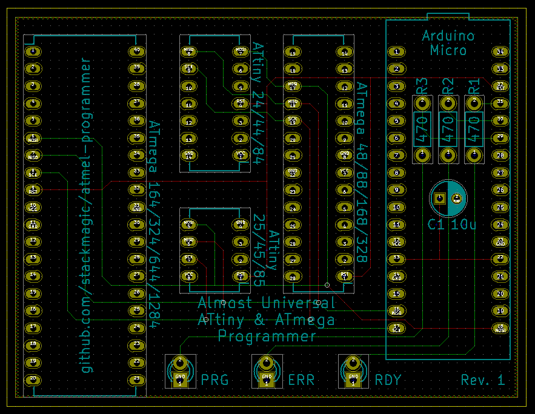
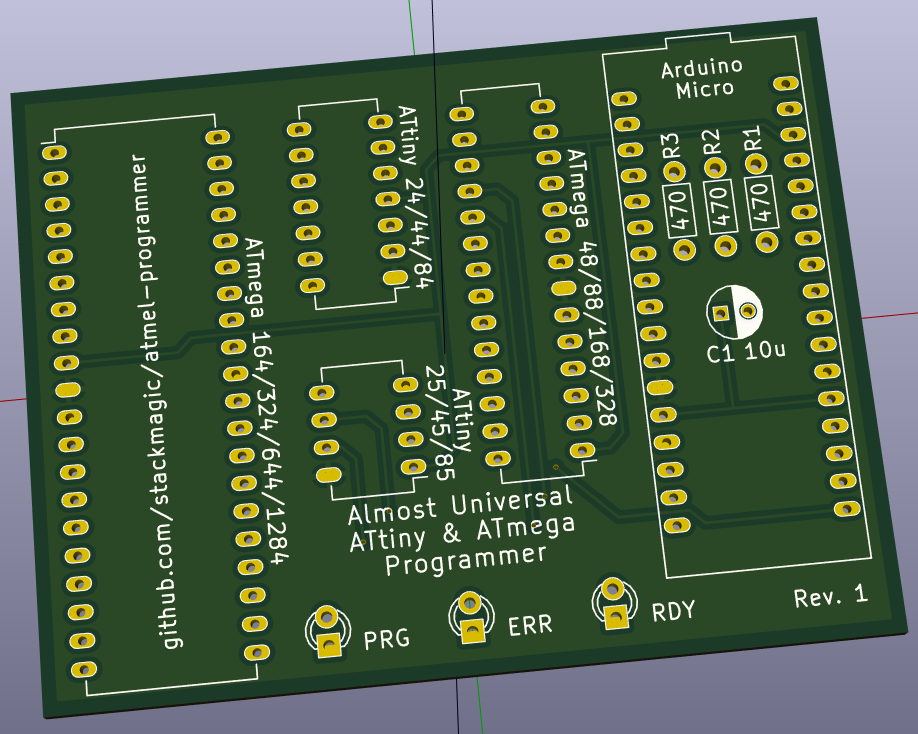
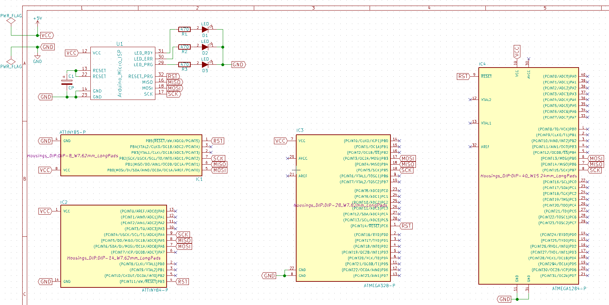
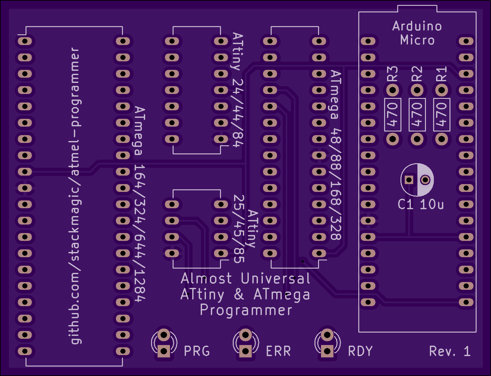
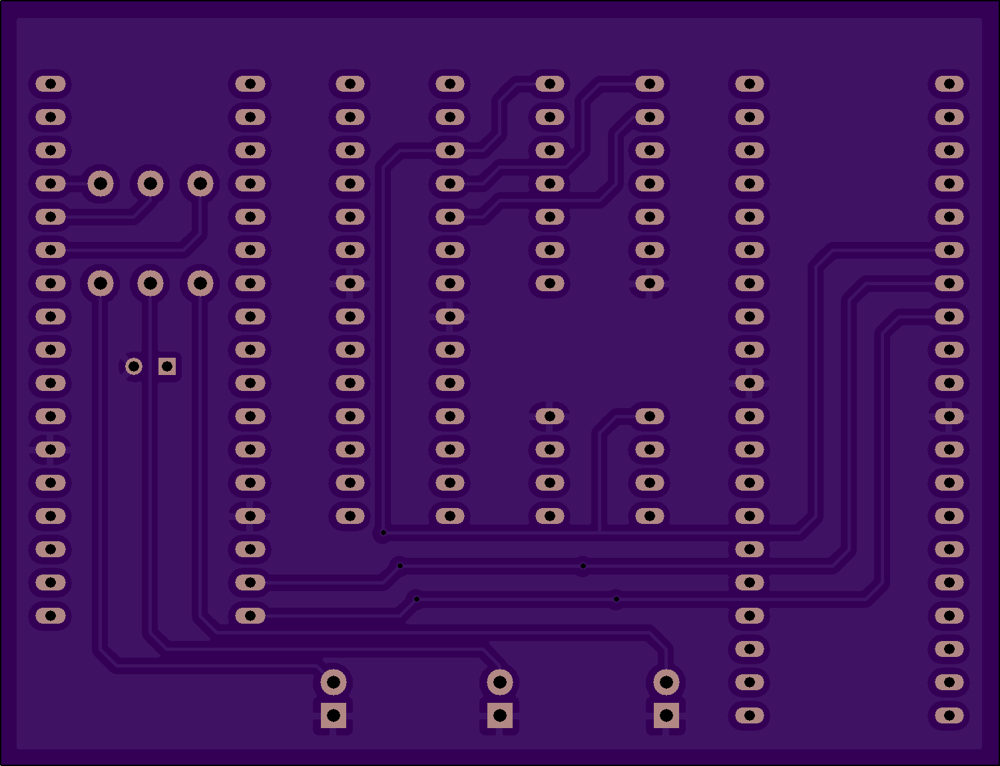

# arduino micro as isp attiny/atmega programmer

a simple pcb with a few sockets to program attiny/atmega microcontrollers from
an arduino micro used as isp programmer

# supported atmel chips

| Microcontroller         |                                              |
|-------------------------|----------------------------------------------|
| ATtiny 24/44/84         | http://www.atmel.com/devices/ATTINY84.aspx   |
| ATtiny 25/45/85         | http://www.atmel.com/devices/ATTINY85.aspx   |
| ATmega 48/88/168/328    | http://www.atmel.com/devices/ATMEGA328.aspx  |
| ATmega 164/324/644/1284 | http://www.atmel.com/devices/ATMEGA1284.aspx |

# usage

all steps below include the use of the Arduino IDE: https://www.arduino.cc/en/Main/Software (1.6 or higher).

Add the following URLs in `File > Preferences` for the setting `Additionals Boards Manager URLs`:

## ATtiny25/45/85 & ATtiny24/44/84 families:

(Supports only 45/85 & 44/84)

https://raw.githubusercontent.com/damellis/attiny/master/package_damellis_attiny_index.json

## ATmega48/88/168/328 family:

(Supports only 168/328)

https://raw.githubusercontent.com/stackmagic/atmega/master/package_carlosefr_atmega_index.json

Note: Once the PR at https://github.com/carlosefr/atmega/pull/4 is merged, use the official URL: https://raw.githubusercontent.com/carlosefr/atmega/master/package_carlosefr_atmega_index.json)

## ATmega164/324/644/1284 family:

https://mcudude.github.io/MightyCore/package_MCUdude_MightyCore_index.json

If you want to program a `Non-P` version (for example an `ATmega1284` instead of an `ATmega1284p`), you need to open your avrdude.conf and add a Section like below. The non-P versions are essentially the same as the P versions and they can be cloned. The plain 644 is supported out of the box (with avrdude 6.0.1).

```
#------------------------------------------------------------
# ATmega1284
#------------------------------------------------------------

part parent "atmega1284p"
    id               = "m1284";
    desc             = "ATmega1284";
    signature        = 0x1e 0x97 0x06;
  ;

#------------------------------------------------------------
# ATmega324
#------------------------------------------------------------

part parent "m324p"
    id               = "m324";
    desc             = "ATmega324";
    signature        = ???????????????????????;
  ;

#------------------------------------------------------------
# ATmega164
#------------------------------------------------------------

part parent "m164p"
    id               = "m164";
    desc             = "ATmega164";
    signature        = ?????????????????????????
  ;
```

## prepare the programmer

* plug in your arduino micro and connect it to the pc
* start up the arduino IDE
* connect your arduino micro
* open up the programmer sketch: `File > Examples > ArduinoISP`
* change the line `#define RESET SS` to `#define RESET 10`
* select `Tools > Board > Arduino Micro`
* burn the programmer to your Arduino Micro with `File > Upload`
* verify the RDY led is pulsing
* select your micro as programmer `Tools > Programmer > Arduino as ISP`

once this is done, you can program as many chips as you want

## burn it

* plug in the chip to program (make sure there's just 1 chip on the board ;))
* open the sketch to program to the chip
* select the correct target board through `Tools > Board > ...`
* burn the sketch using `File > Upload using Programmer`
* the PRG led should light while the program is written
* you're done!

# kicad screenshots






# oshpark rendering




# further reading

## arduino micro ISP

* http://forum.arduino.cc/index.php?topic=156863.15
* http://www.arduino.cc/en/uploads/Main/arduino-micro-schematic.pdf
* https://camo.githubusercontent.com/87e06ff5c55ebb9498f5a3f7f232796a69259489/68747470733a2f2f7261776769746875622e636f6d2f426f756e692f41726475696e6f2d50696e6f75742f6d61737465722f41726475696e6f2532304d6963726f25323050696e6f75742e706e67

